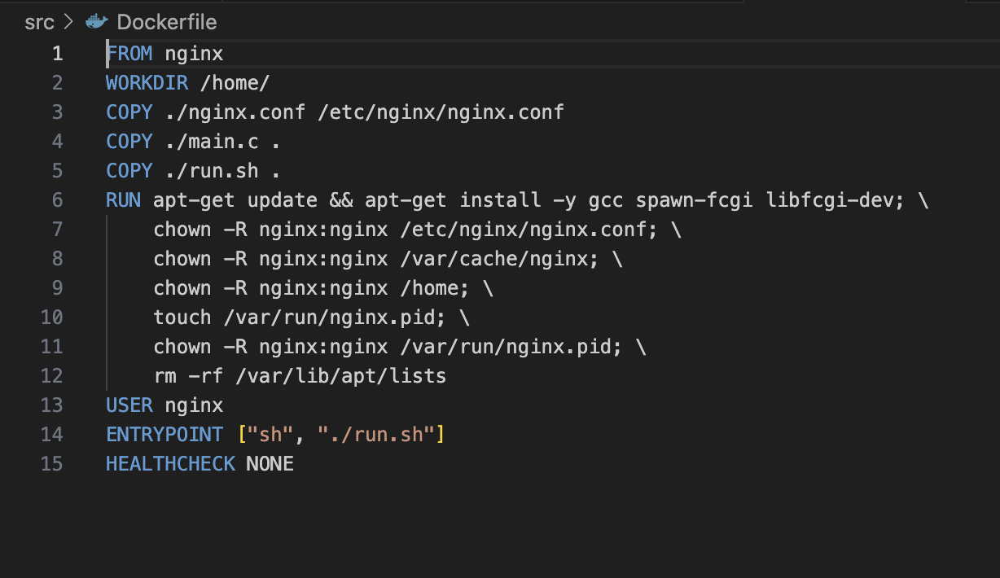

# S21_Simple_Docker. Third project

## Part 1

Для начала требуется установить Docker, зарегистрироваться в Dockerhub. Рекомендую устанавливать Docker по ссылке:

[Установка докера](https://21-school-by-students.notion.site/Docker-install-on-school-iMacs-9354ef106a8a40c6b46a69cea0a11bf8 "Мануал от других студентов")

После установки скачиваем образ nginx `docker pull nginx:latest`

Проверяем наличие докер образа `docker image`. 
Проверяем, что образ запущен `docker ps`

Просматриваем информацию о контейнере и ищем ip порта, размер и порты

Останавливаем контейнер и проверяем, что он остановился 

Запускаем контейнер с портами 80 и 443 в контейнере, замапленными на такие же порты на локальной машине, через команду run

Проверяем, что страница доступна по адресу localhost:80

Перезапускаем докер контейнер командой `docker restart quizzical_mccarthy`

## Part 2
Проверяем наличие запущенных контейнеров и конфигурацию файла nginx.conf 

Добавляем параметры запускка по пути /status

Скопируем файл командой `docker cp` внутрь контейнера, указав пути до файла и до контейнера

Проверяем работоспособность по ссылку localhost/status

Экспортируем контейнер, останавливаем его и удаляем. Контейнер нельзя удалить, который находится в работе.

Импортируем контейнер обратно и запускаем его для проверки работоспособности

## Part 3
Код, позволяющий выводить на странице предоставлен на скрине

Добавляем параметры в nginx.conf для открытия новой страницы

Запустить написанный мини сервер через spawn-fcgi на порту 8080

также скопируем настройки и файл main.c в контейнер
Запуск через spawn-fcgi

Проверить, что в браузере по localhost:81 отдается написанная вами страничка

## Part 4

Dockerfile выглядит следующим образом:

Если Dockerfile прописан корректно, то при запуске сборки, она произойдёт корректно

Проверим образы и запустим контейнер

Собрать написанный докер образ через docker build при этом указав имя и тег

Проверить, что по localhost:80 доступна страничка написанного мини сервера

Запустить собранный докер образ с маппингом 81 порта на 80 на локальной машине и маппингом папки ./nginx внутрь контейнера по адресу, где лежат конфигурационные файлы nginx'а (см. Часть 2)

Дописать в ./nginx/nginx.conf проксирование странички /status, по которой надо отдавать статус сервера nginx

Перезапустить докер образ

Проверить, что теперь по localhost:80/status отдается страничка со статусом nginx

## Part 5

Для начала требуется установить dockle

После зайдём в dockerhub через терминал, сохраним наш образ и проверим его при помощи dockle

Исправим ошибки в Dockerfile и проверим повторно сборку dockle

Повторно правим имеющиеся ошибки и проверяем сборку повторно

## Part 6

Для сборки контейнера через docker-compose.yml требуется написать файл с таким же названием и указать откуда брать Dockerfile и куда производить сборку. В нашем случае мы берём его с пятой части и собираем там, где находится файл с  инструкцией.

Изменим run.sh

Проверим отсутсвие рабочих контейнеров

Для корректной сборки установим командой `brew install docker-compose`

Произведём сборку и поднимем контейнеры командами 
`docker-compose build`
`docker-compose up`

Убедимся, что сервер и прокси собрались и запустились

Проверим работу в браузере на локальном сервере

Также проверим запущенные контейнеры

